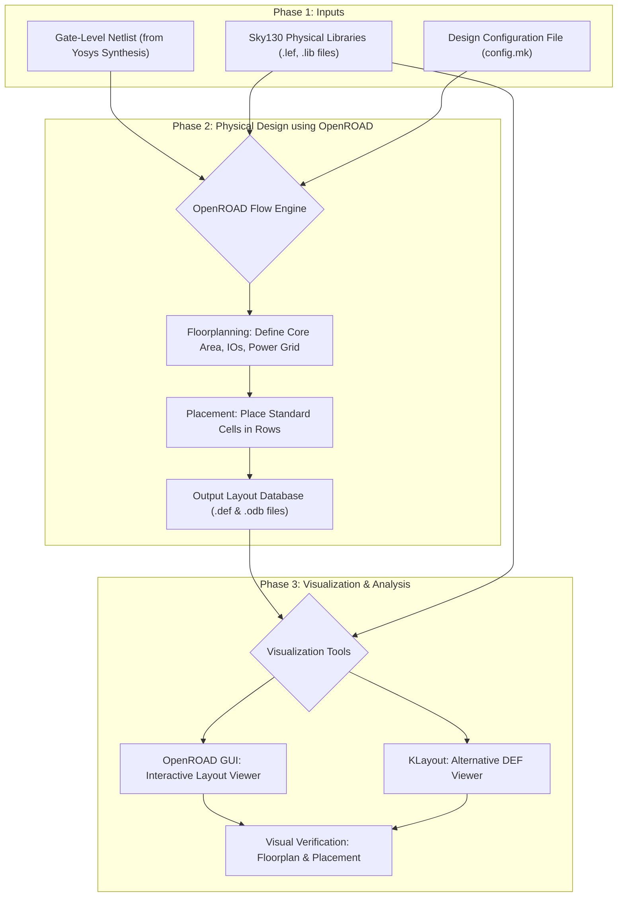

# 🚀 OpenROAD Flow: From RTL to Placement

This repository documents a **complete hands-on flow using OpenROAD** — taking a Verilog RTL design (`gcd`) all the way through **synthesis, floorplanning, and placement** using the **Sky130 HD** PDK.
It includes environment setup, troubleshooting steps, and visualization of the resulting layout using both **OpenROAD GUI** and **KLayout**.

-----

## 🧠 Why This Flow is Important in VLSI Journey

In **VLSI (Very Large Scale Integration) design**, we transform abstract hardware concepts written in a **Hardware Description Language (HDL)** like Verilog into a **physical chip layout** that can be fabricated on silicon. This transformation is called the **RTL-to-GDSII flow**.

The backend physical design steps—**synthesis, floorplanning, placement, clock tree synthesis, and routing**—directly impact the **chip’s performance, power, and area**. By mastering these steps, designers can:

1.  **Bridge Logic and Layout:** Turn logic gates and flip-flops into a manufacturable chip structure.
2.  **Optimize Performance:** Placement and floorplanning affect critical path delays and timing.
3.  **Ensure Power Efficiency:** Proper planning of power rails and cell placement reduces IR drop and leakage.
4.  **Reduce Area:** Efficient utilization of silicon reduces cost and allows more functionality per chip.

-----

## 🏗️ OpenROAD RTL-to-Placement Flowchart



### 🧭 Diagram Explanation

| **Phase** | **Purpose** | **Key Outputs** |
| :--- | :--- | :--- |
| 🟩 Phase 1: Inputs | Collects design and PDK resources. | Verilog Netlist, Sky130 LEF/LIB files, `config.mk` |
| 🟦 Phase 2: Physical Design | OpenROAD flow executes synthesis, floorplan, and placement. | `2_floorplan.def`, `3_place.def`, `.odb` |
| 🟧 Phase 3: Visualization | Layouts are loaded in OpenROAD GUI / KLayout for analysis. | Verified Layout View |

-----

### 💡 Simplified View of Where This Task Fits

| Stage | What Happens |
| :--- | :--- |
| **Synthesis** | Converts your Verilog code into a gate-level netlist of standard logic cells. |
| **Floorplanning** | Defines the chip’s physical dimensions, allocates space for blocks, and plans the power grid (like creating a building blueprint). |
| **Placement** | Places thousands of standard cells within the floorplan, aiming for optimal performance and routability. |

-----

## ⚙️ Step 1: Installation and Setup

### 1.1 Clone the Repository

```bash
# Clones the flow scripts repository and all its submodules (--recursive)
git clone --recursive https://github.com/The-OpenROAD-Project/OpenROAD-flow-scripts.git
# Enters the newly cloned directory
cd OpenROAD-flow-scripts
```


### 1.2 Install Dependencies

```bash
# Runs the official script to install all required libraries and tools
sudo ./etc/DependencyInstaller.sh -all
```
> ⏳ May take an hour or more — especially building libraries like Boost or Eigen.
### 1.3 Check yosys ans openroad

```bash
# Sets up the environment variables (like $PATH) needed to run the tools
source ./env.sh
# Checks if Yosys (synthesis tool) is installed and prints help
yosys -help  
# Checks if OpenROAD (P&R tool) is installed and prints help
openroad -help
```


**Manual setup (if needed):**

```bash
# Refreshes the local package database list
sudo apt update
# Installs all necessary packages for building (compilers, libraries, etc.)
sudo apt install -y build-essential cmake python3 python3-venv python3-pip \
tclsh libreadline-dev bison flex libffi-dev git \
libboost-all-dev clang libeigen3-dev swig \
libx11-dev libxaw7-dev libxrandr-dev libxcb1-dev \
libxinerama-dev libxcursor-dev libxft-dev
```

### 1.3 Build OpenROAD

```bash
# Compiles and builds the OpenROAD application locally from source code
./build_openroad.sh --local
```
> ⏳ May take an hour or more —
-----

## 🏃‍♂️ Step 2: Running the Flow (Up to Placement)

```bash
# Enters the 'flow' directory where the Makefiles are located
cd flow
# Runs the flow up to the 'place' step for the 'gcd' design
make DESIGN_CONFIG=./designs/sky130hd/gcd/config.mk place
```


📁 Output DEF/ODB files in:

```
results/sky130hd/gcd/base/
2_floorplan.def
3_place.def
```


-----

## 🖼️ Step 4: Visualizing the Layout

### 4.1 Using OpenROAD GUI

```bash
# Navigates to the root of the flow scripts directory
cd ~/OpenROAD-flow-scripts
# Sets up the environment variables
source ./env.sh
# Navigates back into the flow directory
cd flow
# Starts the OpenROAD tool in graphical user interface mode
openroad -gui
```

Open floorplan: `results/sky130hd/gcd/base/2_floorplan.odb`
Open placement: `results/sky130hd/gcd/base/3_place.odb`


### OUTPUTS


### 4.2 Using KLayout

```bash
# Navigates directly to the flow directory
cd ~/OpenROAD-flow-scripts/flow
# Starts the OpenROAD tool in command-line (Tcl) mode
openroad
```

In OpenROAD shell:

```tcl
# Reads the base technology LEF file (physical library)
read_lef platforms/sky130hd/lef/sky130_fd_sc_hd.tlef
# Reads the merged LEF file containing all standard cells
read_lef platforms/sky130hd/lef/sky130_fd_sc_hd_merged.lef
# Loads the floorplan database file (.odb) into memory
read_db results/sky130hd/gcd/base/2_floorplan.odb
# Exports the loaded floorplan as a .def file (for KLayout)
write_def results/sky130hd/gcd/base/2_floorplan.def
# Loads the placement database file (.odb) into memory
read_db results/sky130hd/gcd/base/3_place.odb
# Exports the loaded placement as a .def file (for KLayout)
write_def results/sky130hd/gcd/base/3_place.def
# Exits the OpenROAD shell
exit
```


Open in KLayout:

```bash
# Starts KLayout, loading the .lef files as technology and opening the .def layout
klayout -l platforms/sky130hd/lef/sky130_fd_sc_hd.tlef \
        -l platforms/sky130hd/lef/sky130_fd_sc_hd_merged.lef \
        results/sky130hd/gcd/base/2_floorplan.def
```


## 🧾 Results Summary

| Stage | File | Description |
| :--- | :--- | :--- |
| Floorplan | `2_floorplan.odb / .def` | Core area defined, IOs placed |
| Placement | `3_place.odb / .def` | Standard cells placed and legalized |

-----

## 🏁 Conclusion

✅ Installed and configured OpenROAD
✅ Built and debugged all dependencies
✅ Executed RTL → Placement flow
✅ Visualized layout using OpenROAD GUI and KLayout

Demonstrates a **complete mini physical design flow** using **Sky130 PDK**, bridging **digital logic** to **physical chip layout**.

-----
